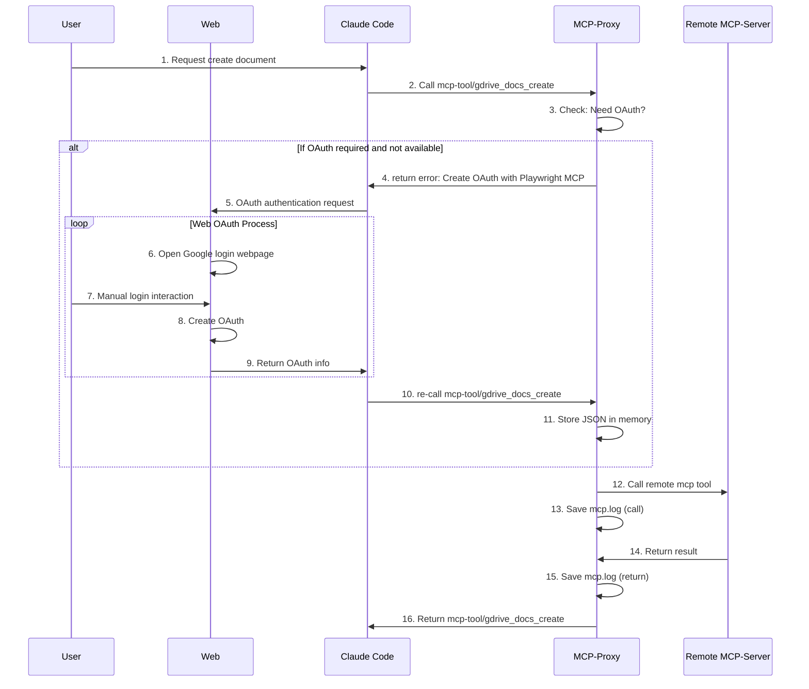

#mcp #ai #llm 
# 만들게 된 배경
# 기본 개념 학습
# 현재 버전

## 아키텍처

```mermaid
sequenceDiagram

participant User as User

participant Web as Web

participant CC as Claude Code

participant Proxy as MCP-Proxy

participant Remote as Remote MCP-Server

  

User->>CC: 1. Request create document

CC->>Proxy: 2. Call mcp-tool/gdrive_docs_create

Proxy->>Proxy: 3. Check: Need OAuth?

alt If OAuth required and not available

Proxy->>CC: 4. return error: Create OAuth with Playwright MCP

CC->>Web: 5. OAuth authentication request

loop Web OAuth Process

Web->>Web: 6. Open Google login webpage

User->>Web: 7. Manual login interaction

Web->>Web: 8. Create OAuth

Web->>CC: 9. Return OAuth info

end

CC->>Proxy: 10. re-call mcp-tool/gdrive_docs_create

Proxy->>Proxy: 11. Store JSON in memory

end

Proxy->>Remote: 12. Call remote mcp tool

Proxy->>Proxy: 13. Save mcp.log (call)

Remote->>Proxy: 14. Return result

Proxy->>Proxy: 15. Save mcp.log (return)

Proxy->>CC: 16. Return mcp-tool/gdrive_docs_create
```

